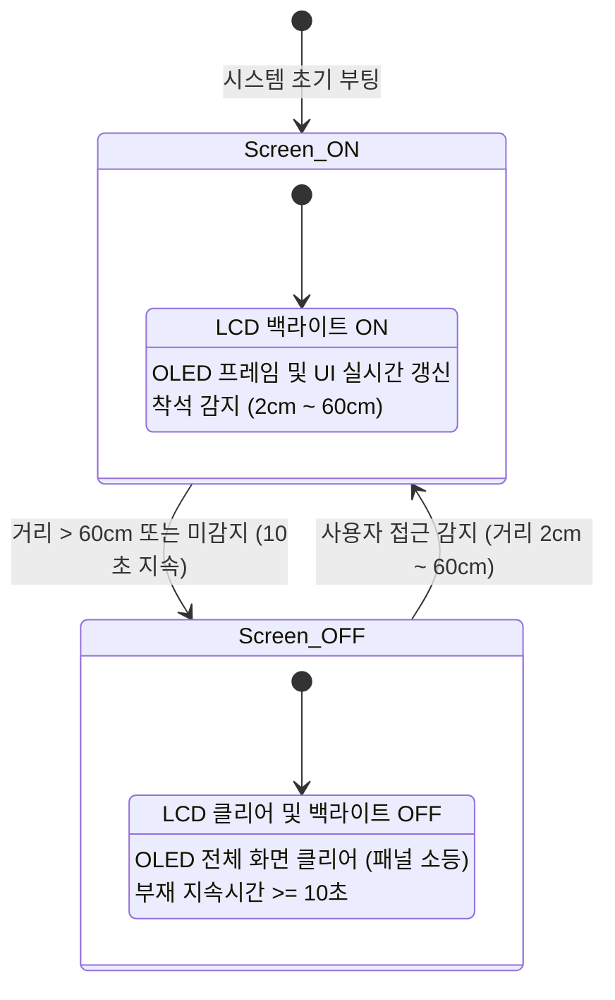

# Phase 1 소프트웨어 아키텍처 및 스마트 파워 설계서

## 1. 시스템 개요
본 문서는 **Smart Desk Environment Monitoring System (Phase 1)**의 펌웨어 소프트웨어 아키텍처, 비차단형 주기적 태스크 스케줄링 구조, 초음파 기반 스마트 파워(자동 절전/기상) 제어 상태 머신, 그리고 듀얼 디스플레이(OLED & LCD1602) UI 렌더링 설계를 정의합니다.

---

## 2. 비차단형 태스크 스케줄러 (Non-blocking Scheduler)

`HAL_Delay()`를 사용하지 않고 SysTick 타이머 기반의 `HAL_GetTick()` 함수를 활용하여 4가지 주기의 독립된 작업을 비차단 방식으로 스케줄링합니다.

```
                    ┌─────────────────────────┐
                    │     Main While Loop     │
                    └────────────┬────────────┘
                                 │
     ┌──────────────┬────────────┴────────────┬──────────────┐
     ▼              ▼                         ▼              ▼
 ┌────────┐    ┌────────┐                ┌────────┐     ┌────────┐
 │ 100ms  │    │ 500ms  │                │ 1000ms │     │ 2000ms │
 └────┬───┘    └────┬───┘                └────┬───┘     └────┬───┘
      │             │                         │              │
      ▼             ▼                         ▼              ▼
 [초음파 측정]   [MCU 내부온도]              [DS1302 시간]  [DHT11 온습도]
 [EMA 필터링]   [ADC DMA 폴링]             [LCD1602 갱신]
 [스마트파워]   [LD2 LED 토글]            [UART 로그]
 [OLED 갱신]
```

### 태스크별 상세 역할
1. **100ms 고속 태스크**:
   - HC-SR04 초음파 센서 트리거 및 에코 측정.
   - EMA(지수 이동 평균) 필터를 적용하여 센서 노이즈 제거.
   - 스마트 파워 상태 머신 실행 (사용자 착석 여부 판정).
   - 활성 모드일 경우 SSD1306 OLED UI(시계, 센서값, 바 게이지, 스피너) 갱신.
2. **500ms 중간 태스크**:
   - ADC DMA 변환 결과를 바탕으로 STM32F103 내장 온도 센서 값 계산.
   - 보드 동작 확인용 LD2(PC13) LED 토글.
3. **1000ms 저속 태스크**:
   - DS1302 3-Wire RTC로부터 현재 시, 분, 초 획득.
   - LCD1602(I2C) 텍스트 화면 갱신 (시간 및 온습도, 거리 요약).
   - USART2(115200bps) 디버그 시리얼 포트로 실시간 텔레메트리 출력.
4. **2000ms 환경 센싱 태스크**:
   - DHT11 센서와 1-Wire 통신을 수행하여 실내 온도(℃) 및 상대습도(%) 측정.

---

## 3. 스마트 파워 (Smart Screen) 시스템 설계

초음파 센서로 측정된 사용자 착석 거리를 모니터링하여 자동으로 디스플레이 전원을 켜고 끄는 친환경 절전 시스템입니다.



### 상태 전이 조건
- **절전 모드 진입 (Sleep Transition)**:
  - 감지 거리 `distance_cm > 60.0cm` 또는 `0.0cm`(범위 초과).
  - 해당 상태가 `SLEEP_TIMEOUT_MS (10,000ms = 10초)` 이상 지속될 때 진입.
  - 실행 동작: LCD 백라이트 소등, OLED 화면 비우기, 절전 로그 출력.
- **기상 모드 진입 (Wake-up Transition)**:
  - 감지 거리 `2.0cm <= distance_cm <= 60.0cm`.
  - 조건 만족 즉시 화면 복귀.
  - 실행 동작: LCD 백라이트 점등, OLED 프레임/타이틀 재초기화 후 즉시 데이터 표시 재개.

---

## 4. 노이즈 억제를 위한 EMA (지수 이동 평균) 필터

초음파 센서의 튀는 측정값(Glitches)을 억제하고 OLED 바 게이지를 부드럽게 표현하기 위해 EMA 필터를 적용합니다.

$$\text{SmoothDist}_t = \alpha \times \text{RawDist}_t + (1 - \alpha) \times \text{SmoothDist}_{t-1}$$

- $\alpha = 0.7$: 최신 측정값에 70%, 이전 평균값에 30%의 가중치를 부여하여 빠른 응답성과 부드러운 움직임을 동시에 달성합니다.

---

## 5. 듀얼 디스플레이 UI 레이아웃

### 5.1 SSD1306 128x64 OLED (SPI)
```
+----------------------------------------+
| SMART DESK MON                       / | <- Header (Y: 0~13)
|----------------------------------------|
|               14:25:36                 | <- Real-time Clock (Y: 17)
|                                        |
|        T: 24.5C    H: 48.0%            | <- Room Temp/Hum (Y: 29)
|        MCU Temp: 32.1C                 | <- Internal ADC Temp (Y: 40)
|                                        |
|        [████████████░░░░░░░░░░]        | <- Proximity Gauge (Y: 52)
+----------------------------------------+
```

### 5.2 LCD1602 16x2 Text Display (I2C)
```
+----------------+
| 14:25:36 24.5C | <- Line 1: [시:분:초] [실내온도]
| H:48% D: 35 M32| <- Line 2: [습도] [거리cm] [내부온도]
+----------------+
```

---

## 6. UART 텔레메트리 출력 형식
- 통신 규격: 115200bps, 8-N-1
- 출력 포맷:
  ```text
  [14:25:36] T:24.5C, H:48.0%, D:35.2cm, McuT:32.1C [Screen:ON]
  [POWER] User absent for 10 sec -> Display OFF (Sleep)
  [POWER] User detected (34.8cm) -> Display ON
  ```
